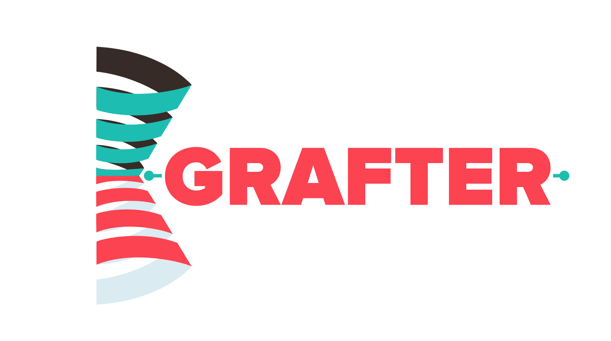

# Grafter

#### Grafter is no longer under active development

On March 1st, 2019 Grafter will enter maintenance mode, from that date, we will no longer review or accept pull requests to this project, or make new releases - the final release will reflect what is available in this repository. 

If anyone in the community is interested in reviving this project and moving it out of maintenance mode, please reach out to [opensource@zalando.de](opensource@zalando.de).

As an open source project driven by Zalando engineers, Grafter has served our Scala projects well over the years and retiring this project is no indicator of lack of Scala use inside Zalando, quite the contrary - this project has simply served its purpose and it is now time to move on. 

----

[

## What's wrong with constructor injection again?

There are [many](https://github.com/adamw/macwire) [libraries](https://github.com/google/guice) or [approaches](http://www.cakesolutions.net/teamblogs/2011/12/19/cake-pattern-in-depth) for doing [dependency injection](https://en.wikipedia.org/wiki/Dependency_injection) in Scala.
Grafter goes back to the fundamentals of dependency injection by *just using constructor injection*: no reflection, no xml, no implementation inheritance or self-types.

Please read the [User Guide](https://zalando.github.io/grafter) to learn how to install and use Grafter.

---

### Contributing

Please read our [contributor guidelines](CONTRIBUTING.md) for more details. 
And please check these [open issues](http://github.com/zalando/grafter/issues) for specific tasks.

Unless you explicitly state otherwise in advance, any non trivial contribution intentionally submitted for 
inclusion in this project by you to the steward of this repository (Zalando SE, Berlin) shall be 
under the terms and conditions of the MIT License as written below, without any additional copyright 
information, terms or conditions.

----

### License

The MIT License (MIT) Copyright © [2017] Zalando SE, https://tech.zalando.com

Permission is hereby granted, free of charge, to any person obtaining a copy of this software and associated documentation files (the “Software”), to deal in the Software without restriction, including without limitation the rights to use, copy, modify, merge, publish, distribute, sublicense, and/or sell copies of the Software, and to permit persons to whom the Software is furnished to do so, subject to the following conditions:

The above copyright notice and this permission notice shall be included in all copies or substantial portions of the Software.

THE SOFTWARE IS PROVIDED “AS IS”, WITHOUT WARRANTY OF ANY KIND, EXPRESS OR IMPLIED, INCLUDING BUT NOT LIMITED TO THE WARRANTIES OF MERCHANTABILITY, FITNESS FOR A PARTICULAR PURPOSE AND NONINFRINGEMENT. IN NO EVENT SHALL THE AUTHORS OR COPYRIGHT HOLDERS BE LIABLE FOR ANY CLAIM, DAMAGES OR OTHER LIABILITY, WHETHER IN AN ACTION OF CONTRACT, TORT OR OTHERWISE, ARISING FROM, OUT OF OR IN CONNECTION WITH THE SOFTWARE OR THE USE OR OTHER DEALINGS IN THE SOFTWARE.
