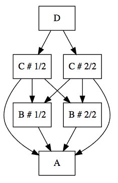

### Inspect your application graph

It might be necessary to inspect (or test) the results of modifications on your application graph after several modifications with
`singleton` and `modify`.

For example you might want to collect all the distinct components of a given type:

```scala
import org.zalando.grafter.syntax.query._

val application = Application.prod.
  replace[HttpConfig](HttpConfig("localhost", 8080))

// this should contain the previously set http config
val httpConfigs: List[HttpConfig] =
  application.collect[HttpConfig]

```

You might also want to check what are all the components using a component of a given type:
```scala
val application = Application.prod.
  singleton[ExecutionService]

// this is a map where the keys are distinct instances of ExecutionService
// (there should be only one, since we made a singleton)
// and a list of all the paths from that key to the root
import org.zalando.grafter.syntax.query._

val usersOfExecutionService: Map[ExecutionService, List[List[Any]]] =
  application.ancestors[ExecutionService]
```

It is also very useful to be able to display a graph of your application with the `Visualize` functionality:

```scala
import org.zalando.grafter.syntax.visualize._

val application = Application.prod

application.asDotString ====
      s"""|strict digraph {
          |  "A" [shape=box];
          |  "B # 1/2" [shape=box];
          |  "B # 2/2" [shape=box];
          |  "C # 1/2" [shape=box];
          |  "C # 2/2" [shape=box];
          |  "D" [shape=box];
          |  "B # 1/2" -> "A"
          |  "B # 2/2" -> "A"
          |  "C # 1/2" -> "A"
          |  "C # 1/2" -> "B # 1/2"
          |  "C # 1/2" -> "B # 2/2"
          |  "C # 2/2" -> "A"
          |  "C # 2/2" -> "B # 1/2"
          |  "C # 2/2" -> "B # 2/2"
          |  "D" -> "C # 1/2"
          |  "D" -> "C # 2/2"
          |}""".stripMargin 
```

`asDotString` produces a `.dot` graph which you can visualize with [webgraphviz](http://www.webgraphviz.com) or similar tools


